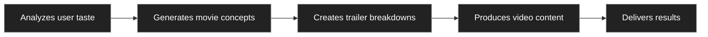

# Fama-French-Three-Factor-Model
First I will use the claasic FF 3 Factor Model to backtest the performance of Carbon-Neutral themed stocks and the corresponding ETF

```mermaid
flowchart LR

    A[Analyzes user taste] --> B[Generates movie concepts]
    B --> C[Creates trailer breakdowns]
    C --> D[Produces video content]
    D --> E[Delivers results]

    style A fill:#222,color:#fff,stroke:#999
    style B fill:#222,color:#fff,stroke:#999
    style C fill:#222,color:#fff,stroke:#999
    style D fill:#222,color:#fff,stroke:#999
    style E fill:#222,color:#fff,stroke:#999
```
